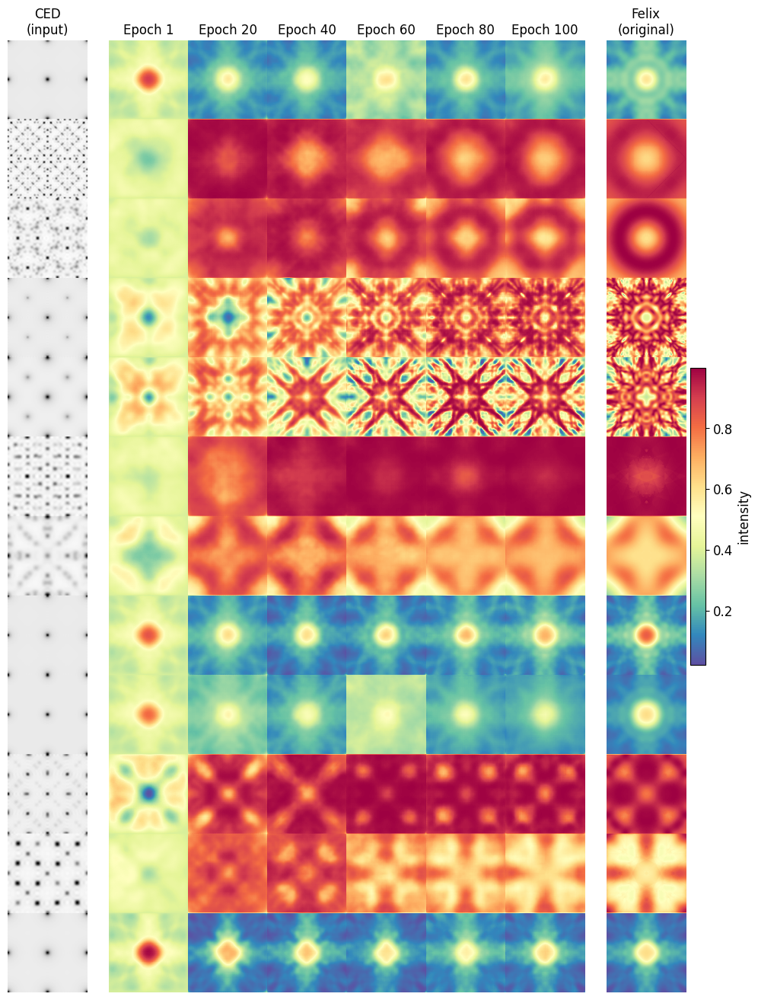
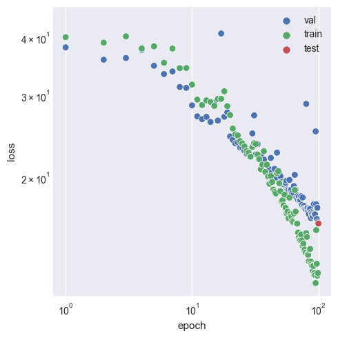

# MS-SSIM Loss Function

SSIM is a perception-based model that considers image degradation as perceived change in structural information, while also incorporating important perceptual phenomena, including both luminance masking and contrast masking terms. The difference with other techniques such as MSE or PSNR is that these approaches estimate absolute errors. Structural information is the idea that the pixels have strong inter-dependencies especially when they are spatially close. These dependencies carry important information about the structure of the objects.

### Tests

The following configurations and models were used.

Configuration

<pre>
+-- data
|   `-- _target_: src.data.FDP_npy_1x128x128.FDPDataModule                                   
|       data_dir: D:\felix-ml/data//FDP                                                      
|       batch_size: 32                                                                       
|       train_val_test_split:                                                                
|       - 9454                                                                               
|       - 1500                                                                               
|       - 1500                                                                               
|       num_workers: 8                                                                       
|       pin_memory: false                                                                    
|                                                                                            
+-- model
|   `-- _target_: src.models.autoencoder.AELitModule                                         
|       config:                                                                              
|         embed_dim: 64                                                                      
|         learning_rate: 0.0001                                                              
|                                                                                            
+-- callbacks
|   `-- model_checkpoint:                                                                    
|         _target_: lightning.pytorch.callbacks.ModelCheckpoint                              
|         dirpath: D:\felix-ml\logs\train\runs\2023-08-08_20-32-58/checkpoints               
|         filename: epoch_{epoch:03d}                                                        
|         monitor: val/loss                                                                  
|         verbose: false                                                                     
|         save_last: false                                                                   
|         save_top_k: -1                                                                     
|         mode: min                                                                          
|         auto_insert_metric_name: false                                                     
|         save_weights_only: false                                                           
|         every_n_train_steps: null                                                          
|         train_time_interval: null                                                          
|         every_n_epochs: 1                                                                  
|         save_on_train_epoch_end: null                                                      
|       early_stopping:                                                                      
|         _target_: lightning.pytorch.callbacks.EarlyStopping                                
|         monitor: val/loss                                                                  
|         min_delta: 0.0                                                                     
|         patience: 100                                                                      
|         verbose: false                                                                     
|         mode: min                                                                          
|         strict: true                                                                       
|         check_finite: true                                                                 
|         stopping_threshold: null                                                           
|         divergence_threshold: null                                                         
|         check_on_train_epoch_end: null                                                     
|       model_summary:                                                                       
|         _target_: lightning.pytorch.callbacks.RichModelSummary                             
|         max_depth: -1                                                                      
|       rich_progress_bar:                                                                   
|         _target_: lightning.pytorch.callbacks.RichProgressBar                              
|                                                                                            
+-- logger
|   `-- csv:                                                                                 
|         _target_: lightning.pytorch.loggers.csv_logs.CSVLogger                             
|         save_dir: D:\felix-ml\logs\train\runs\2023-08-08_20-32-58                          
|         name: csv/                                                                         
|         prefix: ''                                                                         
|                                                                                            
+-- trainer
|   `-- _target_: lightning.pytorch.trainer.Trainer                                          
|       default_root_dir: D:\felix-ml\logs\train\runs\2023-08-08_20-32-58                    
|       min_epochs: 20                                                                       
|       max_epochs: 100                                                                      
|       accelerator: gpu                                                                     
|       devices: 1                                                                           
|       check_val_every_n_epoch: 1                                                           
|       deterministic: false                                                                 
|                                                                                            
+-- paths
|   `-- root_dir: D:\felix-ml                                                                
|       data_dir: D:\felix-ml/data/                                                          
|       log_dir: D:\felix-ml/logs/                                                           
|       output_dir: D:\felix-ml\logs\train\runs\2023-08-08_20-32-58                          
|       work_dir: D:\felix-ml                                                                
|                                                                                            
+-- extras
|   `-- ignore_warnings: false                                                               
|       enforce_tags: true                                                                   
|       print_config: true                                                                   
|                                                                                            
+-- task_name
|   `-- train                                                                                
+-- tags
|   `-- ['dev']                                                                              
+-- train
|   `-- True                                                                                 
+-- test
|   `-- True                                                                                 
+-- compile
|   `-- False                                                                                
+-- ckpt_path
|   `-- None                                                                                 
`-- seed
    `-- None                                                                                 
</pre>

Model

<pre>
┌────┬─────────────────┬─────────────────┬────────┐
│    │ Name            │ Type            │ Params │
├────┼─────────────────┼─────────────────┼────────┤
│ 0  │ model           │ Autoencoder     │  3.9 M │
│ 1  │ model.encoder   │ Encoder         │  1.4 M │
│ 2  │ model.encoder.0 │ Conv2d          │  3.2 K │
│ 3  │ model.encoder.1 │ GDN             │ 16.5 K │
│ 4  │ model.encoder.2 │ Conv2d          │  409 K │
│ 5  │ model.encoder.3 │ GDN             │ 16.5 K │
│ 6  │ model.encoder.4 │ Conv2d          │  409 K │
│ 7  │ model.encoder.5 │ GDN             │ 16.5 K │
│ 8  │ model.encoder.6 │ Conv2d          │  409 K │
│ 9  │ model.encoder.7 │ GDN             │ 16.5 K │
│ 10 │ model.encoder.8 │ Conv2d          │  102 K │
│ 24 │ model.flatten   │ Flatten         │      0 │
│ 11 │ model.fc1       │ Linear          │  262 K │
│ 12 │ model.fc_bn1    │ BatchNorm1d     │  1.0 K │
│ 13 │ model.fc2       │ Linear          │  262 K │
│ 14 │ model.fc_bn2    │ BatchNorm1d     │  1.0 K │
│ 15 │ model.fc3       │ Linear          │ 32.8 K │
│ 16 │ model.fc_bn3    │ BatchNorm1d     │    128 │
│ 17 │ model.fc4       │ Linear          │ 33.3 K │
│ 18 │ model.fc_bn4    │ BatchNorm1d     │  1.0 K │
│ 19 │ model.fc5       │ Linear          │  262 K │
│ 20 │ model.fc_bn5    │ BatchNorm1d     │  1.0 K │
│ 21 │ model.fc6       │ Linear          │  262 K │
│ 22 │ model.fc_bn6    │ BatchNorm1d     │  1.0 K │
│ 23 │ model.relu      │ ReLU            │      0 │
│ 24 │ model.unflatten │ Unflatten       │      0 │
│ 25 │ model.decoder   │ Decoder         │  1.4 M │
│ 26 │ model.decoder.0 │ ConvTranspose2d │  102 K │
│ 27 │ model.decoder.1 │ GDN             │ 16.5 K │
│ 28 │ model.decoder.2 │ ConvTranspose2d │  409 K │
│ 29 │ model.decoder.3 │ GDN             │ 16.5 K │
│ 30 │ model.decoder.4 │ ConvTranspose2d │  409 K │
│ 31 │ model.decoder.5 │ GDN             │ 16.5 K │
│ 32 │ model.decoder.6 │ ConvTranspose2d │  409 K │
│ 33 │ model.decoder.7 │ GDN             │ 16.5 K │
│ 34 │ model.decoder.8 │ ConvTranspose2d │  3.2 K │
│ 35 │ model.decoder.9 │ Sigmoid         │      0 │
│ 36 │ loss_function   │ MS_SSIM_Loss    │      0 │
│ 37 │ train_loss      │ MeanMetric      │      0 │
│ 38 │ val_loss        │ MeanMetric      │      0 │
│ 39 │ test_loss       │ MeanMetric      │      0 │
└────┴─────────────────┴─────────────────┴────────┘
</pre>

**The MS-SSIM trained model evaluated on 12 random samples at various stages in training.**

We see that significant structural progress is still being made at high epochs, signifying that >100 will be required until plateaus are reached. This is made more concrete in the figure below.

**Investigating loss over the course of training.**

Whilst progress is continually being made on the validation set at high epochs, notice that after epoch 30, we have overfitting occur as the training set sees much greater benefits per epoch. This suggests that the 64 latent dimensions (as seen in the configuration) finally becomes a problem when such an intelligent loss function is used. This is in contrast to what is seen when using BCE and MSE, as they do not encounter the same issues at 64 dimensions.